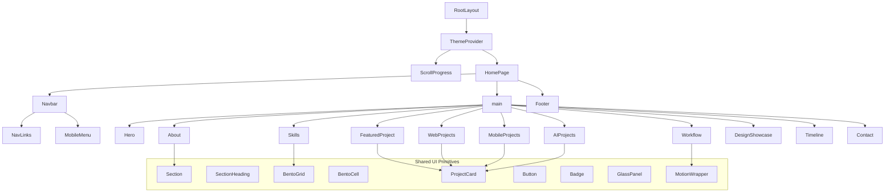

# Component Hierarchy

## Page Composition Tree

The home page (`src/app/page.tsx`) assembles sections top-to-bottom. Each section is a self-contained module that imports data from `src/data/` and UI primitives from `src/components/ui/`.

```
RootLayout (app/layout.tsx)
│
├── ThemeProvider
├── ScrollProgress
│
└── HomePage (app/page.tsx)
    │
    ├── Navbar
    │   ├── Logo / Name
    │   ├── NavLinks
    │   │   └── NavLink × N
    │   └── MobileMenu
    │       ├── MenuToggle (Button)
    │       └── NavLinks (mobile variant)
    │
    ├── <main>
    │   │
    │   ├── Hero
    │   │   ├── HeroBackground
    │   │   ├── AnimatedText (name)
    │   │   ├── Badge × 4 (role branding)
    │   │   ├── AnimatedText (intro)
    │   │   └── Button × 2 (CTAs)
    │   │
    │   ├── About
    │   │   ├── Section
    │   │   ├── SectionHeading
    │   │   ├── GlassPanel (intro text)
    │   │   └── BentoGrid
    │   │       ├── BentoCell (Areas of Interest)
    │   │       ├── BentoCell (Career Goals)
    │   │       └── BentoCell (Current Focus)
    │   │
    │   ├── Skills
    │   │   ├── Section
    │   │   ├── SectionHeading
    │   │   └── BentoGrid
    │   │       └── SkillCategory × 7
    │   │           ├── SectionHeading (category name)
    │   │           └── Badge × N (individual skills)
    │   │
    │   ├── Workflow
    │   │   ├── Section
    │   │   ├── SectionHeading
    │   │   └── Workflow (horizontal/vertical pipeline)
    │   │       └── WorkflowStep × 6
    │   │           ├── Step number/icon
    │   │           ├── Step label
    │   │           └── Connector arrow
    │   │
    │   ├── FeaturedProject
    │   │   ├── Section
    │   │   ├── SectionHeading
    │   │   ├── ProjectCard (hero variant)
    │   │   └── BentoGrid (detail blocks)
    │   │       ├── ProjectDetailBlock (Problem)
    │   │       ├── ProjectDetailBlock (Solution)
    │   │       ├── ProjectDetailBlock (Features)
    │   │       ├── ProjectDetailBlock (Technologies)
    │   │       ├── ProjectDetailBlock (Process)
    │   │       └── ProjectDetailBlock (Impact)
    │   │
    │   ├── WebProjects
    │   │   ├── Section
    │   │   ├── SectionHeading
    │   │   └── BentoGrid
    │   │       └── ProjectCard × N
    │   │
    │   ├── MobileProjects
    │   │   ├── Section
    │   │   ├── SectionHeading
    │   │   └── BentoGrid
    │   │       └── ProjectCard × N
    │   │
    │   ├── AIProjects
    │   │   ├── Section
    │   │   ├── SectionHeading
    │   │   └── BentoGrid
    │   │       └── ProjectCard × N
    │   │
    │   ├── DesignShowcase
    │   │   ├── Section
    │   │   ├── SectionHeading
    │   │   └── DesignGallery
    │   │       └── DesignCard × N
    │   │           ├── ImageWithFallback
    │   │           ├── title, category
    │   │           └── Badge × N (tools)
    │   │
    │   ├── Timeline
    │   │   ├── Section
    │   │   ├── SectionHeading
    │   │   └── Timeline (vertical)
    │   │       └── TimelineEntry × 4
    │   │           ├── year marker
    │   │           └── description
    │   │
    │   └── Contact
    │       ├── Section
    │       ├── SectionHeading
    │       ├── GlassPanel (intro)
    │       ├── IconLink × 4 (social)
    │       └── ContactForm (Phase 2)
    │
    └── Footer
        ├── name + branding
        ├── copyright
        └── built-with badges
```

---

## Mermaid Diagram



---

## Reusable Component Strategy

### Tier 1 — Atomic UI (`components/ui/`)

Small, single-responsibility components with no business logic. Accept props for variants, sizes, and content.

| Component | Reused In | Variants |
|-----------|-----------|----------|
| `Button` | Hero, Contact, Navbar, ProjectCard | primary, secondary, ghost, outline |
| `Card` / `GlassPanel` | Skills, About, Contact, Projects | default, highlighted, large |
| `Badge` | Hero, Skills, all Project sections | default, tech, role |
| `Section` | Every section | — |
| `SectionHeading` | Every section | with/without subtitle |
| `BentoGrid` | Skills, About, Projects, Featured | 2-col, 3-col, asymmetric |
| `BentoCell` | All BentoGrid consumers | span-1, span-2, span-row-2 |
| `ProjectCard` | Web, Mobile, AI, Featured | default, featured, compact |
| `IconLink` | Contact, Footer, ProjectCard | social, tech, external |
| `Container` | All sections | sm, md, lg, full |

### Tier 2 — Composed Sections (`components/sections/`)

Section components orchestrate layout and data binding. They should:

1. Import content from `src/data/`
2. Compose Tier 1 UI components
3. Apply section-specific layout only
4. Wrap content in `MotionWrapper` for scroll animations
5. Export a single default component via `index.ts`

### Tier 3 — Shared Utilities (`components/shared/`)

| Component | Purpose |
|-----------|---------|
| `MotionWrapper` | Standardizes `whileInView` fade/slide behavior |
| `TechIcon` | Maps technology name string → SVG icon component |
| `ExternalLink` | Enforces `rel="noopener noreferrer"` and accessible labels |

---

## Composition Rules

### Do

- Pass data down as props from section → UI components
- Keep section components under ~150 lines; extract sub-components when larger
- Use `Section` wrapper for consistent `id`, `aria-labelledby`, and padding
- Co-locate section-specific sub-components in the section folder

### Do Not

- Import data directly inside UI primitives
- Duplicate card layouts across project sections — use `ProjectCard` with variants
- Put animation logic inline in every section — centralize in `MotionWrapper` and `lib/animations.ts`
- Create section-specific button or badge styles — extend UI variants instead

---

## Props Flow Pattern

```
src/data/projects.ts
        │
        ▼ (import)
WebProjects.tsx (section)
        │
        ▼ (map + pass props)
ProjectCard.tsx (ui)
        │
        ├── Badge.tsx (tags)
        ├── Button.tsx (view project)
        └── ImageWithFallback.tsx (thumbnail)
```

---

## Client vs Server Component Boundaries

| Component | Server / Client | Reason |
|-----------|-----------------|--------|
| `layout.tsx` | Server | Metadata, fonts, static shell |
| `page.tsx` | Server | Composes sections; no interactivity |
| Most sections | Server | Static content rendering |
| `Navbar` / `MobileMenu` | Client | Menu toggle state |
| `MotionWrapper` | Client | Framer Motion requires client |
| `ScrollProgress` | Client | Scroll event listener |
| `ThemeProvider` | Client | Theme toggle state |
| `ContactForm` | Client | Form state and validation |
| `DesignGallery` | Client | Lightbox interaction (Phase 2) |
| UI primitives (Button, Card, etc.) | Server unless animated | Keep client boundary shallow |

**Rule of thumb:** Push `"use client"` as far down the tree as possible to minimize client JavaScript bundle size.

---

## Barrel Export Convention

Each section folder includes `index.ts` that re-exports the main component:

```
sections/Hero/index.ts  →  export { Hero } from './Hero'
```

The home page imports cleanly:

```
import { Hero } from '@/components/sections/Hero'
import { About } from '@/components/sections/About'
```

Use `@/` path alias (configured in `tsconfig.json`) for all internal imports.
